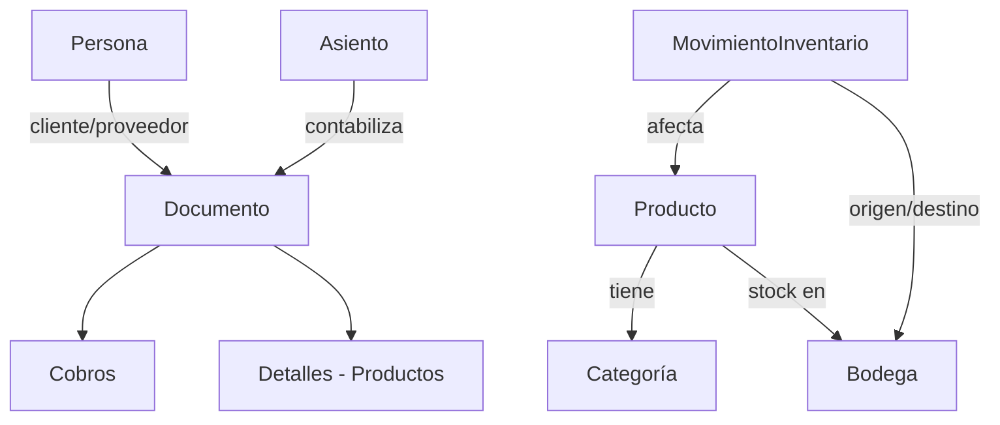

# Super Guía de la API REST Contífico v2

## Índice
1. [Introducción](#1-introducción)
2. [Autenticación](#2-autenticación)
3. [URL Base](#3-url-base)
4. [Formatos de Fecha](#4-formatos-de-fecha)
5. [Paginación](#5-paginación)
6. [Visión General de Recursos](#6-visión-general-de-recursos)
7. [Guía por Recurso](#7-guía-por-recurso)
   - 7.1. [Asientos (Contabilidad)](#71-asientos-contabilidad)
   - 7.2. [Personas](#72-personas)
   - 7.3. [Categorías](#73-categorías)
   - 7.4. [Bodegas](#74-bodegas)
   - 7.5. [Productos](#75-productos)
   - 7.6. [Documentos](#76-documentos)
   - 7.7. [Cobros](#77-cobros)
   - 7.8. [Cuentas Bancarias](#78-cuentas-bancarias)
   - 7.9. [Formas de Pago](#79-formas-de-pago)
   - 7.10. [Parámetros](#710-parámetros)
   - 7.11. [Movimientos de Inventario](#711-movimientos-de-inventario)
   - 7.12. [Unidades](#712-unidades)
8. [Esquemas de Datos Importantes](#8-esquemas-de-datos-importantes)
9. [Ejemplos de Flujos de Trabajo](#9-ejemplos-de-flujos-de-trabajo)
10. [Notas y Consideraciones](#10-notas-y-consideraciones)

---

## 1. Introducción

La API REST de Contífico v2 permite integrar sistemas externos con la plataforma de gestión empresarial Contífico. A través de esta API puedes administrar:

- **Contabilidad**: Asientos contables
- **Personas**: Clientes, proveedores, empleados
- **Inventario**: Productos, categorías, bodegas, movimientos
- **Facturación**: Documentos (facturas, notas de crédito, cotizaciones, etc.)
- **Pagos**: Cobros, formas de pago, cuentas bancarias

La API sigue principios REST, utiliza JSON para intercambio de datas y requiere autenticación mediante API Key.

## 2. Autenticación

Todos los requests deben incluir el header `Authorization` con tu API Key:

```http
Authorization: SECRETKEY
```

> **Nota**: Reemplaza `SECRETKEY` con tu API Key proporcionada por Contífico tras solicitarla vía soporte al cliente.

Ejemplo con cURL:
```bash
curl -H "Authorization: TU_API_KEY" https://api.contifico.com/sistema/api/v2/...
```

## 3. URL Base

```
https://api.contifico.com/sistema
```

Todos los endpoints se construyen relativamente a esta URL. Por ejemplo:  
`GET https://api.contifico.com/sistema/api/v2/persona/`

## 4. Formatos de Fecha

La API utiliza diferentes formatos según el contexto:

| Contexto | Formato | Ejemplo |
|---------|---------|---------|
| Consultas (query params) | `AAAA-MM-DD` | `2026-05-05` |
| Documentos (fecha_emision, fecha_creacion) | `dd/mm/aaaa` | `05/05/2026` |
| Productos (fecha_creacion) | `dd/mm/aaaa` | `22/04/2024` |
| Inventario (fecha) | `dd/mm/aaaa` | `04/08/2026` |

**Importante**: Algunos parámetros de consulta como `modificados_desde_fecha` usan formato `AAAA-MM-DD`.

## 5. Paginación

Para endpoints que devuelven listas grandes, se puede usar paginación:

- **Parámetro `page`**: Número de página (string)
- **Parámetro `result_page`**: Número de página (integer, para documentos)
- **Parámetro `result_size`**: Cantidad de resultados por página (para documentos)

Ejemplo:
```
GET /api/v2/persona/?page=2
GET /api/v2/documento/?result_page=1&result_size=50
```

## 6. Visión General de Recursos

La API organiza la información en los siguientes recursos principales:



### Relaciones Clave:
- **Personas** pueden ser clientes o proveedores de **Documentos**
- **Documentos** contienen **Productos** en sus detalles y tienen **Cobros** asociados
- **Productos** pertenecen a **Categorías** y tienen stock en **Bodegas**
- **Movimientos de Inventario** modifican el stock de productos en bodegas
- Los **Asientos** contables se generan automáticamente o manualmente desde documentos/movimientos

## 7. Guía por Recurso

### 7.1. Asientos (Contabilidad)

Gestiona asientos contables.

#### Endpoints:
| Método | Endpoint | Descripción |
|--------|----------|-------------|
| GET | `/api/v2/contabilidad/asiento/` | Listar asientos con detalles |
| GET | `/api/v2/contabilidad/asiento/{id_integracion}` | Obtener asiento por ID |

#### Parámetros de Consulta (GET /asiento/):
- `page`: Número de página
- `fecha_inicial`: Fecha inicial (DD/MM/AAAA)
- `fecha_final`: Fecha final (DD/MM/AAAA)
- `centro_costo`: ID de centro de costo

#### Estructura del Asiento:
```json
{
  "id": "GOjZdyPoooTybJ4m",
  "detalles": {
    "cuenta_id": "MZN5wbojDFXaxEO0",
    "centro_costo_id": "EGOjZdy8yUNbJ4mz",
    "tipo": "D",       // D: Debe, H: Haber
    "valor": 10.0
  },
  "glosa": "Glosa del asiento",
  "fecha": "16/05/2017"
}
```

---

### 7.2. Personas

Gestiona clientes, proveedores, empleados y otros tipos de personas.

#### Endpoints:
| Método | Endpoint | Descripción |
|--------|----------|-------------|
| GET | `/api/v2/persona/` | Listar personas |
| POST | `/api/v2/persona/?pos={api_token}` | Crear persona |
| GET | `/api/v2/persona/{id_integracion}/` | Obtener persona |
| PUT | `/api/v2/persona/{id}/?pos={api_token}` | Actualizar persona |

#### Parámetros de Consulta (GET /persona/):
- `search`: Busca en razon_social, nombre_comercial, cedula, ruc
- `estado`: A (activo), I (inactivo)
- `tipo`: N (Natural), J (Jurídica), I (SinId), P (Placa)
- `es_cliente`: true/false
- `es_proveedor`: true/false
- `modificados_desde_fecha`: Formato AAAA-MM-DD
- `categoria_id`: ID de categoría

#### Campos Obligatorios para Crear/Actualizar:
- `tipo`: (N/J/I/P)
- `razon_social`
- `cedula`
- `es_cliente` O `es_proveedor` (al menos uno true)
- Para personas Jurídicas: `ruc` es obligatorio (opcional pero requerido para jurídicas)

#### Ejemplo de Creación (POST):
```json
POST /api/v2/persona/?pos=ceaa9097-1d76-4eb8-0000-6f412fa0297b
{
  "razon_social": "Nueva persona Natural",
  "email": "prueba@gmail.com",
  "tipo": "N",
  "es_cliente": true,
  "cedula": "0901563874"
}
```

#### Tipos de Persona:
| Tipo | Descripción | Campos Adicionales |
|------|-------------|-------------------|
| N | Natural | cedula obligatoria |
| J | Jurídica | ruc obligatorio |
| I | Sin Identificación | personaasociada_id opcional |
| P | Placa | placa obligatoria |
| Extranjero | Natural/Jurídica extranjera | es_extranjero: true, cedula/ruc pueden ser texto |

---

### 7.3. Categorías

Gestiona categorías de productos.

#### Endpoints:
| Método | Endpoint | Descripción |
|--------|----------|-------------|
| GET | `/api/v2/categoria/` | Listar categorías |
| POST | `/api/v2/categoria/` | Crear categoría |
| GET | `/api/v2/categoria/{id_integracion}/` | Obtener categoría |
| PUT | `/api/v2/categoria/{id_integracion}/` | Actualizar categoría |

#### Campos:
- `nombre` (obligatorio, máximo 300 caracteres)

#### Ejemplo:
```json
{
  "id": "7DkPbkDBHkWd5Y9L",
  "nombre": "BOTAS"
}
```

---

### 7.4. Bodegas

Gestiona bodegas/almacenes.

#### Endpoints:
| Método | Endpoint | Descripción |
|--------|----------|-------------|
| GET | `/api/v2/bodega/` | Listar bodegas |
| GET | `/api/v2/bodega/{id_integracion}/` | Obtener bodega |

#### Campos:
- `nombre`: Nombre de la bodega
- `codigo`: Código de la bodega
- `venta`: Indica si está para venta
- `compra`: Indica si está para compra
- `produccion`: Indica si está para producción

#### Ejemplo:
```json
{
  "id": "nRMdROzqhvDZel6Y",
  "nombre": "Bodega Principal",
  "codigo": "BOD001",
  "venta": true,
  "compra": true,
  "produccion": true
}
```

---

### 7.5. Productos

Gestiona el catálogo de productos y servicios.

#### Endpoints:
| Método | Endpoint | Descripción |
|--------|----------|-------------|
| GET | `/api/v2/producto/` | Listar productos |
| POST | `/api/v2/producto/` | Crear producto |
| GET | `/api/v2/producto/{id_integracion}` | Obtener producto |
| PUT | `/api/v2/producto/{id_integracion}/` | Actualizar producto |
| GET | `/api/v2/producto/{id_integracion}/stock/` | Obtener stock por bodega |

#### Parámetros de Consulta:
- `estado`: A (activo), I (inactivo)
- `categoria_id`: Filtrar por categoría
- `filtro`: Busca por nombre o código
- `page`: Paginación (100 items por página)

#### Campos Obligatorios para Crear:
- `codigo`: Código único (máximo 25 caracteres)
- `nombre`
- `minimo`: Stock mínimo
- `estado`: A o I
- `pvp1`: Precio de venta 1 (o `pvp_manual: true`)
- `tipo`: PRO (producto) o SER (servicio) - opcional, por defecto PRO

#### Ejemplo de Creación (POST):
```json
POST /api/v2/producto/
{
  "codigo": "1134",
  "nombre": "Producto Ejemplo",
  "tipo_producto": "SIM",  // SIM:simple, COM:combo, COP:compuesto, PRO:producción
  "para_pos": true,
  "categoria_id": "k0pZeVAzu4wdGWXQ",
  "porcentaje_iva": 12,
  "pvp1": 15.50,
  "minimo": 10,
  "estado": "A",
  "unidad": "QRYjbqjR1i7dLNgm",
  "cuenta_venta_id": "ljMEegoqlUg0eQ5g",
  "cuenta_compra_id": "6x01dNwRzhnleX7W"
}
```

#### Obtener Stock (GET /producto/{id}/stock/):
```json
{
  "bodega_nombre": "Bodega Principal",
  "bodega_id": "BQ9pdBB26H52d8KE",
  "cantidad": 5.0
}
```

---

### 7.6. Documentos

Gestiona facturas, notas de crédito, cotizaciones, etc.

#### Endpoints:
| Método | Endpoint | Descripción |
|--------|----------|-------------|
| GET | `/api/v2/documento/` | Listar documentos |
| POST | `/api/v2/documento/` | Crear documento |
| PUT | `/api/v2/documento/` | Actualizar documento |
| GET | `/api/v2/documento/estado/{id_integracion}` | Estado de documento electrónico |

#### Tipos de Documento:
| Código | Descripción |
|--------|-------------|
| FAC | Factura |
| NCT | Nota de Crédito |
| COT | Cotización |
| PRE | Prefactura |
| LQC | Liquidación de Compra |
| OCV | Orden CompraVenta |
| NVE | Nota de Venta |
| DNA | Documento No Autorizado |

#### Tipos de Registro:
- `CLI`: Cliente
- `PRO`: Proveedor

#### Parámetros de Consulta (GET /documento/):
- `tipo`: Filtra por tipo de documento
- `tipo_registro`: CLI o PRO
- `fecha_emision`: Fecha emisión
- `fecha_inicial` / `fecha_final`: Rango de fechas
- `persona_id`: ID de persona
- `bodega_id`: ID de bodega
- `estado`: P (pendiente), C (cobrado), G (pagado), A (anulado), E (generado), F (facturado)

#### Estructura del Documento:
```json
{
  "id": "8J0yel9lMS9naER7",
  "pos": "883bab80-5352-4f14-8fd8-f0cd7d43a861",
  "fecha_emision": "20/11/2025",
  "tipo_documento": "FAC",
  "tipo_registro": "CLI",
  "documento": "001-500-000009013",
  "estado": "P",
  "autorizacion": "123123123124",
  "persona": { /* objeto Persona */ },
  "detalles": {
    "producto_id": "P1mBdJ6Eys4rd0J6",
    "cantidad": 2.0,
    "precio": 9.0,
    "porcentaje_iva": 0,
    "base_cero": 18.0,
    "base_gravable": 0.0
  },
  "subtotal_0": "18.0",
  "subtotal_12": "0.0",
  "iva": "0.0",
  "total": "18.0",
  "cobros": { /* objeto Cobro */ }
}
```

#### Crear Documento (POST):
```json
POST /api/v2/documento/
{
  "pos": "tu-api-token",
  "fecha_emision": "05/05/2026",
  "tipo_documento": "FAC",
  "tipo_registro": "CLI",
  "documento": "001-001-000000001",
  "autorizacion": "1234567890",
  "cliente": {
    "cedula": "0922054366",
    "razon_social": "Cliente Ejemplo",
    "tipo": "N"
  },
  "detalles": {
    "producto_id": "RZxg87rxLh9Mb1pV",
    "cantidad": 1,
    "precio": 100.0,
    "porcentaje_iva": 12,
    "base_gravable": 100.0
  },
  "subtotal_0": 0,
  "subtotal_12": 100.0,
  "iva": 12.0,
  "total": 112.0
}
```

#### Estado de Documento Electrónico (GET /documento/estado/{id}):
```json
{
  "documento_id": "MRYWb4j7ViRmeZ1m",
  "tipo_registro": "CLI",
  "tipo_documento": "FAC",
  "estado": "Autorizado"  // Firmado, Enviado a SRI, Autorizado, No Firmado
}
```

---

### 7.7. Cobros

Gestiona los cobros/pagos asociados a documentos.

#### Endpoints:
| Método | Endpoint | Descripción |
|--------|----------|-------------|
| GET | `/api/v2/documento/{id_integracion}/cobro/` | Listar cobros de un documento |
| POST | `/api/v2/documento/{id_integracion}/cobro/` | Registrar cobro |

#### Formas de Cobro:
- `EF`: Efectivo
- `CQ`: Cheque
- `TC`: Tarjeta de Crédito
- `TRA`: Transferencia

#### Ejemplo de Registro (POST):
```json
POST /api/v2/documento/{id}/cobro/
{
  "forma_cobro": "TC",
  "monto": 112.0,
  "fecha": "05/05/2026",
  "tipo_ping": "D",  // D:datafast, M:medianet, E:dataexpress, P:placetopay
  "numero_comprobante": "123456"
}
```

---

### 7.8. Cuentas Bancarias

#### Endpoints:
| Método | Endpoint | Descripción |
|--------|----------|-------------|
| GET | `/api/v2/banco/cuenta/` | Listar cuentas |
| GET | `/api/v2/banco/cuenta/{id_integracion}/` | Obtener cuenta |

#### Estructura:
```json
{
  "id": "BQ9pdBZ3tD6d8KEN",
  "nombre": "CTA PACIFICO",
  "numero": "1204567890",
  "tipo_cuenta": "CA",  // CC:cuenta corriente, CA:cuenta de ahorros
  "saldo_inicial": "100.0",
  "estado": "A",
  "nombre_banco": "BAC INTERNATIONAL BANK",
  "cuenta_contable": "Banco prueba"
}
```

---

### 7.9. Formas de Pago

Obtiene las formas de pago asociadas a un documento.

#### Endpoint:
`GET /api/v2/documento/{id_integracion}/forma_pago`

#### Ejemplo:
```json
{
  "forma_pago": "OCSF",  // Código de forma de pago
  "plazo": 0,
  "unidad": "D",  // D:días
  "valor": 4.0
}
```

---

### 7.10. Parámetros

Obtiene parámetros globales de la empresa.

#### Endpoint:
`GET /api/v2/empresa/parametros`

#### Ejemplo:
```json
{
  "nombre": "habilitar_ajuste_asiento",
  "tipo": "HAB",
  "valor": "False"
}
```

---

### 7.11. Movimientos de Inventario

Gestiona ingresos, egresos, traslados y ajustes de inventario.

#### Endpoints:
| Método | Endpoint | Descripción |
|--------|----------|-------------|
| GET | `/api/v2/movimiento-inventario/` | Listar movimientos |
| POST | `/api/v2/movimiento-inventario/` | Crear movimiento |
| GET | `/api/v2/movimiento-inventario/{id_integracion}` | Obtener movimiento |

#### Tipos de Movimiento:
- `ING`: Ingreso
- `EGR`: Egreso
- `TRA`: Traslado (requiere `bodega_destino_id`)
- `AJU`: Ajuste de costo

#### Campos Obligatorios para Crear:
- `bodega_id`: Bodega de origen
- `tipo`: ING/EGR/TRA/AJU
- `fecha`: (dd/mm/aaaa)
- `detalles`: Array de productos con `producto_id`, `cantidad`, `precio` (obligatorio para ING)
- `descripcion`

#### Ejemplo de Ingreso (POST):
```json
POST /api/v2/movimiento-inventario/
{
  "tipo": "ING",
  "fecha": "01/01/2026",
  "bodega_id": "ljMEegJAHq0dQ5g3",
  "descripcion": "Ingreso de mercadería",
  "detalles": [
    {
      "producto_id": "RZxgepYRySlMa1pV",
      "cantidad": 10.0,
      "precio": 5.50
    }
  ]
}
```

---

### 7.12. Unidades

#### Endpoints:
| Método | Endpoint | Descripción |
|--------|----------|-------------|
| GET | `/api/v2/unidad/` | Listar unidades |
| GET | `/api/v2/unidad/{id_integracion}` | Obtener unidad |

#### Ejemplo:
```json
{
  "id": "QRYjbqjR1i7dLNgm",
  "nombre": "Toneladas"
}
```

---

## 8. Esquemas de Datos Importantes

### Persona (Resumido)
| Campo | Tipo | Descripción | Obligatorio |
|-------|------|-------------|-------------|
| id | string | ID de integración (16 chars) | Solo lectura |
| tipo | string | N/J/I/P | Sí |
| razon_social | string | Nombre o razón social | Sí |
| cedula | string | 10 chars | Sí |
| ruc | string | 13 chars | Para jurídicas |
| es_cliente | boolean | Rol cliente | Sí (o es_proveedor) |
| es_proveedor | boolean | Rol proveedor | Sí (o es_cliente) |
| email | string | Correo electrónico | No |
| telefono | string | Teléfono | No |

### Producto (Resumido)
| Campo | Tipo | Descripción | Obligatorio |
|-------|------|-------------|-------------|
| id | string | ID de integración | Solo lectura |
| codigo | string | Código único (máx 25) | Sí |
| nombre | string | Nombre del producto | Sí |
| tipo | string | PRO/SER | No (default PRO) |
| tipo_producto | string | SIM/COM/COP/PRO | No |
| pvp1 | decimal | Precio venta 1 | Sí (o pvp_manual) |
| minimo | decimal | Stock mínimo | Sí |
| estado | string | A/I | Sí |
| categoria_id | string | ID de categoría | No |

### Documento (Resumido)
| Campo | Tipo | Descripción | Obligatorio |
|-------|------|-------------|-------------|
| id | string | ID de integración | Solo lectura |
| pos | string | API Token del POS | Sí |
| tipo_documento | string | FAC/NCT/COT/etc. | Sí |
| tipo_registro | string | CLI/PRO | Sí |
| fecha_emision | date | dd/mm/aaaa | Sí |
| documento | string | Número de documento | Sí |
| autorizacion | string | Número de autorización | Sí |
| subtotal_0 | decimal | Subtotal IVA 0% | Sí |
| subtotal_12 | decimal | Subtotal IVA 12% | Sí |
| iva | decimal | Valor IVA | Sí |
| total | decimal | Total del documento | Sí |
| detalles | object | Productos del documento | Sí |

---

## 9. Ejemplos de Flujos de Trabajo

### Flujo 1: Crear Producto y luego Facturarlo

1. **Crear Producto**:
   ```http
   POST /api/v2/producto/
   ```
   (Ver ejemplo en sección 7.5)

2. **Consultar Stock** (opcional):
   ```http
   GET /api/v2/producto/{producto_id}/stock/
   ```

3. **Crear Factura** con ese producto:
   ```http
   POST /api/v2/documento/
   ```
   (Ver ejemplo en sección 7.6)

4. **Registrar Cobro** para la factura:
   ```http
   POST /api/v2/documento/{documento_id}/cobro/
   ```

### Flujo 2: Movimiento de Inventario (Traslado entre Bodegas)

1. **Crear Traslado**:
   ```json
   POST /api/v2/movimiento-inventario/
   {
     "tipo": "TRA",
     "fecha": "05/05/2026",
     "bodega_id": "bodega_origen_id",
     "bodega_destino_id": "bodega_destino_id",
     "descripcion": "Traslado de mercadería",
     "detalles": [{"producto_id": "xxx", "cantidad": 5}]
   }
   ```

### Flujo 3: Crear Cliente y Facturar

1. **Crear Persona** (cliente):
   ```http
   POST /api/v2/persona/?pos={api_token}
   ```
2. **Crear Factura** asociada a ese cliente.

---

## 10. Notas y Consideraciones

### Errores Comunes:
- **500 Internal Server Error**: Algunos endpoints pueden devolver 500. Verifica los parámetros y intenta nuevamente.
- **Fechas**: Asegúrate de usar el formato correcto según el endpoint.
- **IDs**: Los IDs de integración suelen ser strings de 16 caracteres alfanuméricos.

### Campos de Solo Lectura:
Muchos campos marcados como `readOnly` en la especificación no deben enviarse en requests de creación/actualización. Ejemplos:
- `id`, `fecha_creacion`, `fecha_modificacion`, `cantidad_stock`, `saldo`, etc.

### Documentos Electrónicos (SRI):
Para documentos electrónicos, usa el endpoint de estado:
```
GET /api/v2/documento/estado/{id}
```
Verifica: `firmado`, `enviado_sri`, `autorizado_sri`.

### Parámetro `habilitar_comiexpress`:
La creación/actualización de productos puede comportarse diferente si este parámetro está habilitado en la empresa.

### Máximos de Caracteres:
- Códigos de producto: máximo 25 caracteres
- Cédula: 10 caracteres
- RUC: 13 caracteres

### Ejemplo de Request Completo con cURL:

```bash
# Consultar personas
curl -X GET "https://api.contifico.com/sistema/api/v2/persona/" \
  -H "Authorization: TU_API_KEY" \
  -H "Content-Type: application/json"

# Crear documento (factura)
curl -X POST "https://api.contifico.com/sistema/api/v2/documento/" \
  -H "Authorization: TU_API_KEY" \
  -H "Content-Type: application/json" \
  -d '{
    "pos": "tu-api-token",
    "fecha_emision": "05/05/2026",
    "tipo_documento": "FAC",
    "tipo_registro": "CLI",
    "documento": "001-001-000000001",
    "autorizacion": "1234567890",
    "cliente": {
      "cedula": "0922054366",
      "razon_social": "Cliente Ejemplo",
      "tipo": "N"
    },
    "subtotal_0": 0,
    "subtotal_12": 100.0,
    "iva": 12.0,
    "total": 112.0,
    "detalles": {
      "producto_id": "RZxg87rxLh9Mb1pV",
      "cantidad": 1,
      "precio": 100.0,
      "porcentaje_iva": 12,
      "base_gravable": 100.0
    }
  }'
```

---

**Guía generada a partir de la especificación OpenAPI v2 y documentación oficial de Contífico.**
